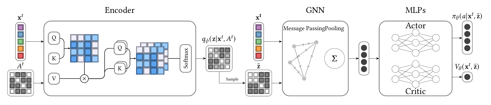

# Intro
This repository adopts the Idea of [Kipf et al.](https://arxiv.org/abs/1802.04687) for RL agents.
We train RL agents with encoder that predicts discrete graph structures on a fixed set of nodes. The agents are supposed
to learn optimal actions _and_ optimal stepwise graph structures.

# Setup
I used `conda 24.9.1` and `python 3.12.10`

## Dependencies
### Step 0: (Optional) If you are on bwUniCluster:
```commandline
module load devel/miniforge
```
### Step 1: Clone Repo & Install dependencies
Clone the repository and `cd` into the cloned folder.

**If you use a virtual env**
```commandline
python -m venv .venv
source .venv/bin/activate
pip install -r requirements.txt
```
**If you use conda**
```commandline
conda env create -f environment.yaml
conda activate L2RPN
```
## Download and split scenarios
Download the required data. This may take a while.
```commandline
python setup_envs.py
```
Now your home directory (under linux, for other os I don't know) will contain the powergrid data used in the episodes.
Furthermore, it is split into training, testing, and validation episodes.

## Train a model
Training scripts are located under `training_scripts`. To train a relations aware PPO, run:
```commandline
PYTHONPATH=$(pwd)/src python experiments/train.py experiment=test_minimal training=ppo_test model=ragnn obs_space=graph relation_awareness=default experiment.seed=0 rollouts=test_minimal training=ppo_test evaluation=test_minimal
```
Similarly, the other scripts can be run.
To adapt parameters explore the `configs`-folder
# Project
This project contains the following folders:
- **configs**: hydra configs containing hyperparameters
- **data**: necessary data to instantiate action spaces and observation converters 
- **experiments**: entry points in the code
- **results**: folder to which results are written
- **slurm**: scripts to run the code on UC3 / HoreKa
- **src**: main source-code

The `src`-package contains the following packages:
- **agents**: Several agent wrappers for the G2OP ecosystem
- **algorithms**: Custom DQN, SAC, PPO and optuna extensions
- **analysis**: Code to analyze agents/models once they are trained
- **core**: Common code shared across several packages
- **grid2o_env**: RLlib environment implementation
- **rarl**: general relation awareness implementation
- **rarl_rllib**: wrapper for RA compatibility with RLlib
- **test**: Unittests
- **visualization**: Notebooks to create figures

Running anything in this project should create output in the `data`-folder. This data can then be visualized by the 
visualization notebook.


